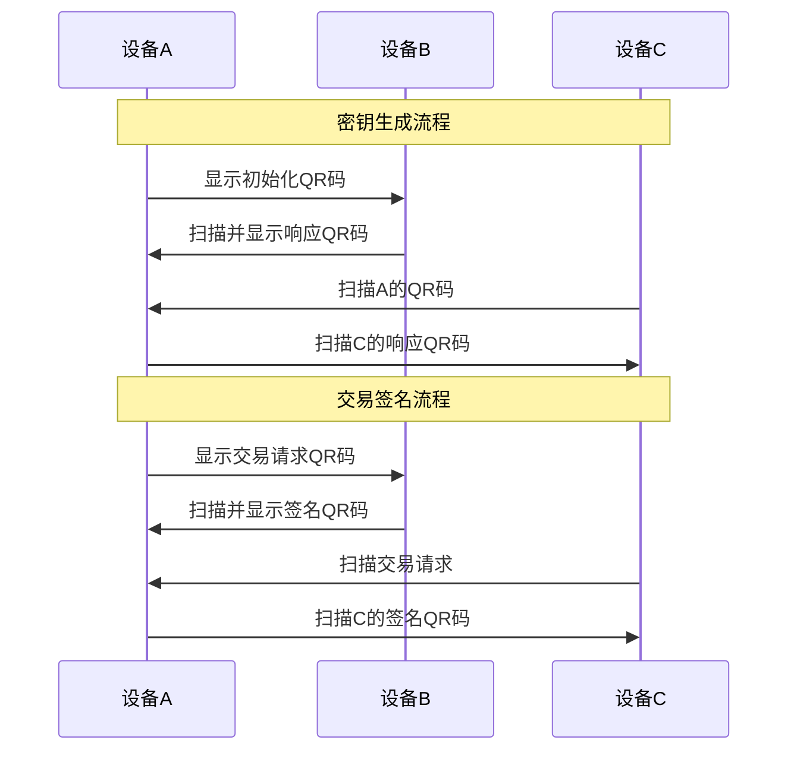

# MPC Wallet - 多方计算钱包

一个基于Coinbase MPC技术的Android钱包应用，支持多方计算密钥生成和签名，通过二维码进行安全的设备间通信。

## 功能特性

### 🔐 多方计算 (MPC)
- **阈值签名**: 支持 t-of-n 阈值签名方案
- **密钥分片**: 使用Shamir秘密分享算法分割私钥
- **无单点故障**: 没有任何一方能够单独控制私钥

### 📱 纯客户端架构
- **离线操作**: 所有MPC计算都在本地进行
- **无需服务器**: 不依赖于中心化服务器
- **设备间通信**: 通过二维码进行数据传输

### 🔗 多链支持
- **以太坊** (Ethereum) - 通过Infura连接
- **Polygon** - Layer 2 解决方案
- **币安智能链** (BSC) - 兼容EVM
- **比特币** (Bitcoin) - 基础支持

### 📲 二维码通信
- **密钥生成**: 通过QR码协调多方密钥生成
- **交易签名**: 扫描QR码参与交易签名过程
- **数据分片**: 大数据自动分割为多个QR码

## 技术架构

### 核心组件

```
app/
├── crypto/              # 密码学组件
│   ├── MPCKeyGenerator.kt   # MPC密钥生成器
│   └── MPCSigner.kt         # MPC签名器
├── network/             # 网络服务
│   └── EthereumService.kt   # 以太坊网络接口
├── utils/               # 工具类
│   └── QRCodeManager.kt     # 二维码管理器
├── data/                # 数据层
│   ├── models/              # 数据模型
│   └── database/            # 本地数据库
└── ui/                  # 用户界面
    ├── screens/             # 界面组件
    └── components/          # 可复用组件
```

### 技术栈

- **Android SDK**: 最低版本 24 (Android 7.0)
- **Kotlin**: 现代化的Android开发语言
- **Jetpack Compose**: 声明式UI框架
- **Room Database**: 本地数据存储
- **BouncyCastle**: 密码学库
- **Web3j**: 以太坊客户端库
- **ZXing**: 二维码处理库

## 安装配置

### 前置要求

1. **Android Studio**: Hedgehog | 2023.1.1 或更高版本
2. **JDK**: Java 8 或更高版本
3. **Android SDK**: API Level 24+ (Android 7.0+)

### 环境配置

1. 克隆项目：
```bash
git clone <repository-url>
cd MPCWallet
```

2. 配置Infura API密钥：
   - 在 `MPCWalletApplication.kt` 中替换 `YOUR_INFURA_KEY_HERE`
   - 或通过环境变量配置：
   ```kotlin
   private const val INFURA_KEY = BuildConfig.INFURA_API_KEY
   ```

3. 构建项目：
```bash
./gradlew build
```

4. 运行应用：
```bash
./gradlew installDebug
```

## 使用指南

### 创建MPC钱包

1. **启动应用**: 打开MPC钱包应用
2. **创建钱包**: 点击右下角的"+"按钮
3. **设置参数**: 配置阈值（如2-of-3）
4. **协调生成**: 与其他参与方交换QR码完成密钥生成

### 发送交易

1. **选择钱包**: 从钱包列表中选择要使用的钱包
2. **创建交易**: 填写接收地址和金额
3. **生成QR码**: 创建交易请求QR码
4. **收集签名**: 与其他参与方交换签名QR码
5. **广播交易**: 收集足够签名后自动广播

### QR码通信流程



## 安全考虑

### 密钥安全
- ✅ 私钥永不完整存储在任何单个设备上
- ✅ 使用硬件安全模块（如果可用）
- ✅ 密钥分片使用AES-256加密存储
- ✅ 支持生物识别认证

### 通信安全
- ✅ QR码数据包含会话ID和序列号
- ✅ 支持数据完整性验证
- ✅ 防重放攻击保护
- ⚠️ 设备间通信依赖物理安全

### 备份恢复
- ✅ 支持密钥分片备份
- ✅ 阈值恢复机制
- ❌ 种子词恢复（不适用于MPC）

## 开发说明

### 项目结构

```
MPCWallet/
├── app/                    # 主应用模块
│   ├── src/main/java/      # 源代码
│   ├── src/main/res/       # 资源文件
│   └── build.gradle        # 模块构建配置
├── build.gradle            # 项目构建配置
├── settings.gradle         # 项目设置
└── gradle.properties       # Gradle属性
```

### 密码学实现

本项目使用简化的MPC实现作为概念验证。在生产环境中，应该：

1. **集成Coinbase CB-MPC库**: 使用经过审计的密码学实现
2. **硬件安全**: 集成TEE (Trusted Execution Environment)
3. **形式化验证**: 确保协议的正确性和安全性

### 构建配置

```gradle
android {
    compileSdk 34
    minSdk 24
    targetSdk 34
    
    buildFeatures {
        compose true
    }
    
    compileOptions {
        sourceCompatibility JavaVersion.VERSION_1_8
        targetCompatibility JavaVersion.VERSION_1_8
    }
}
```

## 测试

### 单元测试
```bash
./gradlew test
```

### 集成测试
```bash
./gradlew connectedAndroidTest
```

### MPC协议测试
运行多设备模拟测试以验证MPC协议的正确性。

## 部署

### 发布构建
```bash
./gradlew assembleRelease
```

### 代码混淆
ProGuard规则已配置以保护敏感代码：
- 密码学类
- MPC协议实现
- 数据模型

## 贡献指南

1. Fork项目
2. 创建功能分支
3. 提交更改
4. 创建Pull Request

## 许可证

本项目基于MIT许可证开源 - 详见 [LICENSE](LICENSE) 文件。

## 免责声明

⚠️ **重要提醒**: 这是一个概念验证项目，不应用于存储实际的加密货币资产。在生产环境中使用前，需要：

- 完整的安全审计
- 密码学专家审查
- 大量的测试和验证
- 集成经过验证的MPC库

## 支持

如有问题或建议，请：
- 创建Issue
- 联系开发团队
- 查看文档

---

**MPC Wallet** - 让多方计算钱包变得简单易用 🚀 